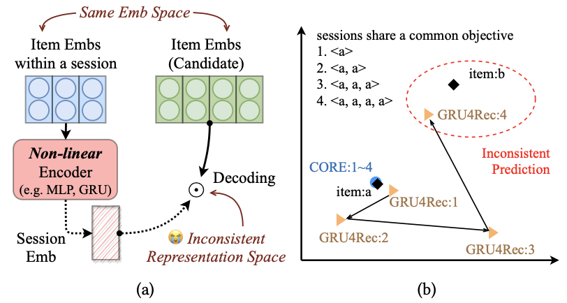
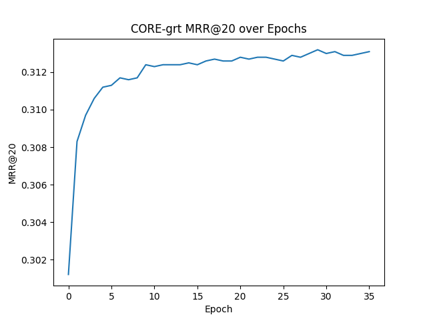
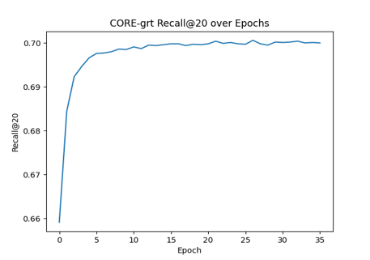
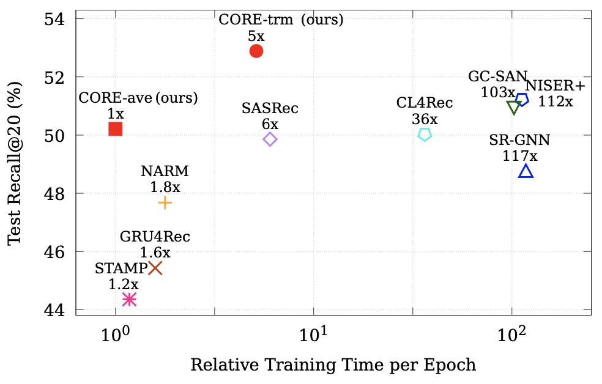

# CORE

This is the official PyTorch implementation for the [paper](https://arxiv.org/abs/2204.11067):
> Yupeng Hou, Binbin Hu, Zhiqiang Zhang, Wayne Xin Zhao. CORE: Simple and Effective Session-based Recommendation within Consistent Representation Space. SIGIR 2022 short.

## Overview

We argue that session embedding encoded by non-linear encoder is usually not in the same representation space as item embeddings, resulting in the inconsistent prediction issue. In this work, we aim at unifying the representation space throughout the encoding and decoding process in session-based recommendation, and propose a simple and effective framework named CORE.

<div  align="center"> 

</div>

## Requirements

```
recbole==1.0.1
python==3.7
pytorch==1.7.1
cudatoolkit==10.1
```

## Datasets

you can download the processed datasets from [Google Drive](https://drive.google.com/drive/folders/1dlJ3PzcT5SCN8-Mocr_AIQPGk9DVgTWB?usp=sharing). Then,
```bash
mv DATASET.zip dataset
unzip DATASET.zip
```

`DATASET` can be one of
* `diginetica`
* `nowplaying`
* `retailrocket`
* `tmall`
* `yoochoose`

## 🛠️ Environment Setup

To ensure compatibility with the CORE implementation and RecBole framework, we recommend using **Python 3.7** with a virtual environment.

---

### 🔹 Step 1: Install Python 3.7

Download Python 3.7 from the official website:

👉 https://www.python.org/downloads/release/python-370/

During installation:
- Check **"Add Python to PATH"**
- Install for all users (recommended)

Verify installation:

```bash
python --version

```

### Step 2: Create Virtual Environment

## Using Conda (Recommended)
If you have Anaconda or Miniconda installed, run:

```bash
conda create -n core_env python=3.7
conda activate core_env
```

### Step 3: Install Required Packages
Once your environment is activated, install the necessary dependencies:

```bash
pip install torch==1.7.1
pip install recbole==1.0.1 
```

### Step 4: Verify Installation
To ensure PyTorch was installed correctly, run:

```bash
python -c "import torch; print(torch.__version__)"
```
### Expected output:

```bash
1.7.1
```

### Step 5: Run the Project
Execute the main script with your desired model and dataset:

```bash
python main.py --model grt --dataset yoochoose
```


## Results

Here we show results on YooChoose dataset for example, other results can be found in our paper.

 


## Acknowledgement

The implementation is based on the open-source recommendation library [RecBole](https://github.com/RUCAIBox/RecBole) and [RecBole-GNN](https://github.com/RUCAIBox/RecBole-GNN).

Please cite the following papers as the references if you use our codes or the processed datasets.

```
@inproceedings{hou2022core,
  author = {Yupeng Hou and Binbin Hu and Zhiqiang Zhang and Wayne Xin Zhao},
  title = {CORE: Simple and Effective Session-based Recommendation within Consistent Representation Space},
  booktitle = {{SIGIR}},
  year = {2022}
}


@inproceedings{zhao2021recbole,
  title={Recbole: Towards a unified, comprehensive and efficient framework for recommendation algorithms},
  author={Wayne Xin Zhao and Shanlei Mu and Yupeng Hou and Zihan Lin and Kaiyuan Li and Yushuo Chen and Yujie Lu and Hui Wang and Changxin Tian and Xingyu Pan and Yingqian Min and Zhichao Feng and Xinyan Fan and Xu Chen and Pengfei Wang and Wendi Ji and Yaliang Li and Xiaoling Wang and Ji-Rong Wen},
  booktitle={{CIKM}},
  year={2021}
}
```
